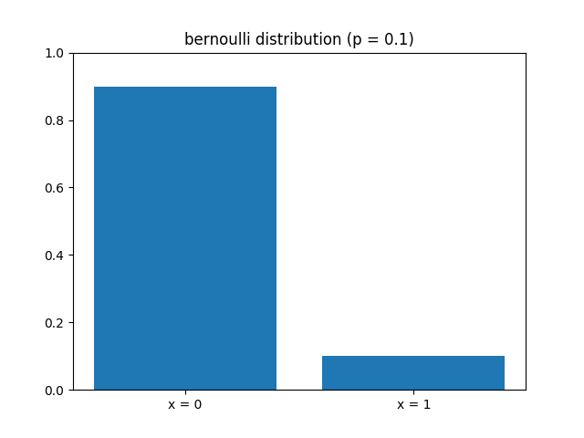
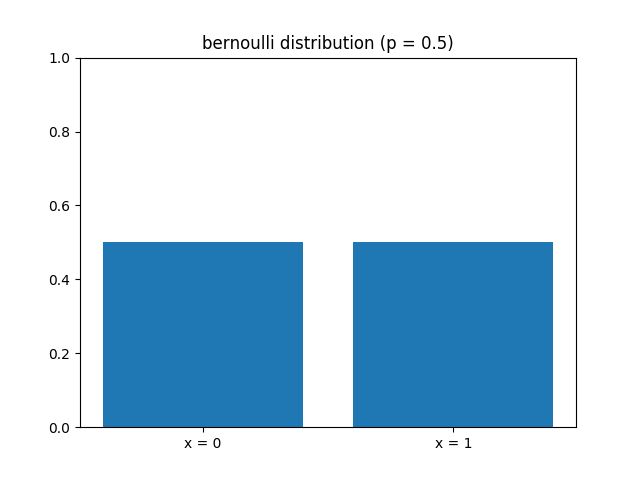
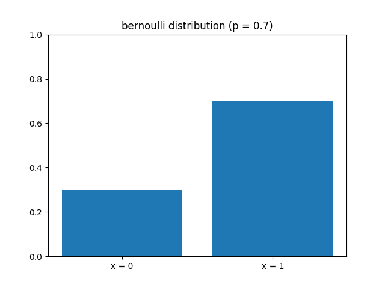
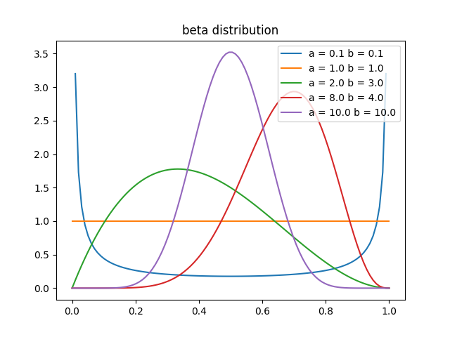
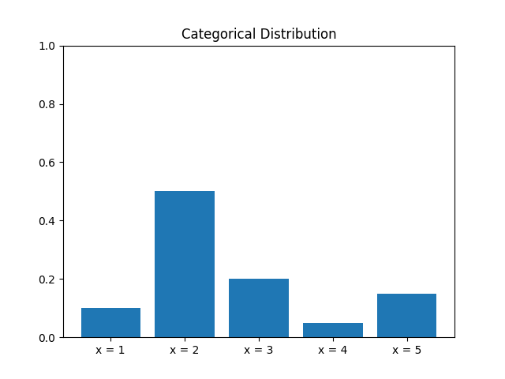
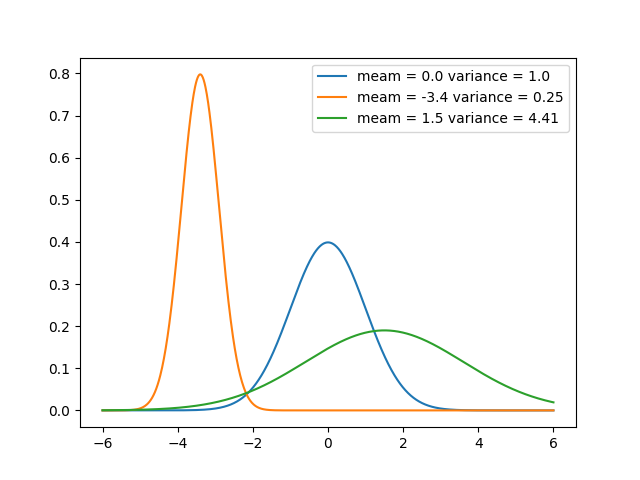
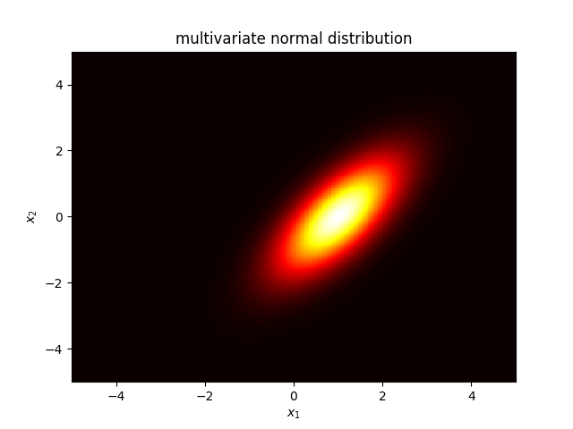
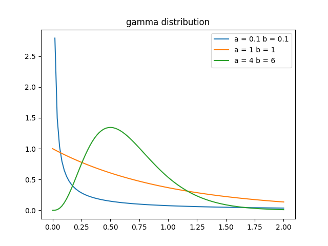

Source codes for Machine Learning
 ---
 
I upload source codes and figures for Machine Learning.
I have implemented the following some distributions.
1. __bernoulli distribution__
2. __beta distribution__
3 __categorical distribution__
4. __unicariate normal distribution__
5. __multivariate normal distribution__
6. __gamma distribution__

Libraries Used
---
- Python
  1. [numpy](http://www.numpy.org/)
  2. [scikit-learn](http://scikit-learn.org/stable/)
  3. [matplotlib](https://matplotlib.org)
  
Usage for some programe
---
1. __You type [python file_name] on your terminal.__
2. __You can save some figures of each distribution.__
3. __You can change some parameter of each distribution.__

Result
---
 
 

 
Developers
---
Implementor
 - [Tatsurou Miyazaki]

