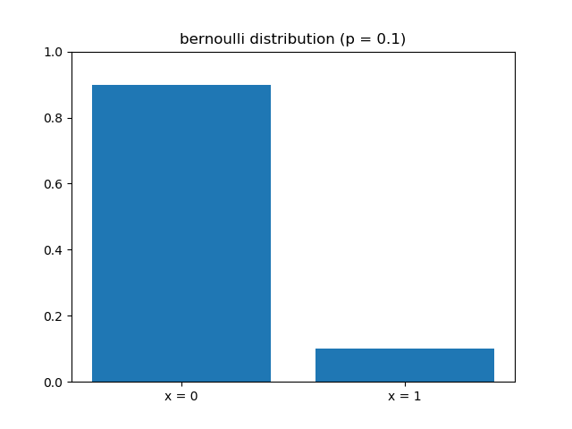
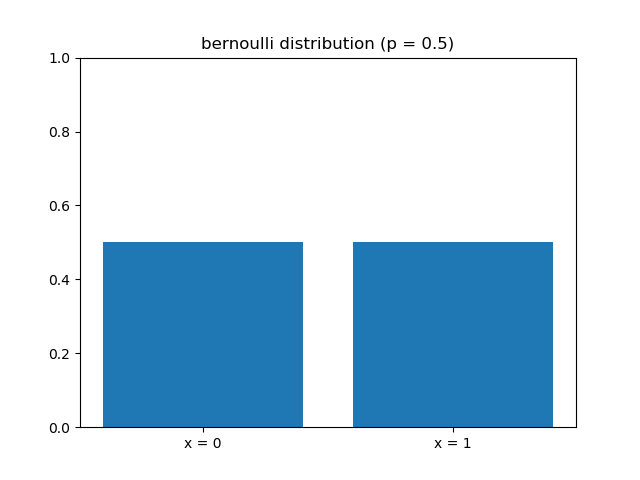
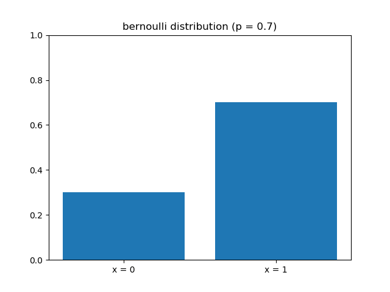

Source codes for Bernoulli distribution
 ---
 
I upload source codes and figures for Machine Learning.

Libraries Used
---
- Python
  1. [numpy](http://www.numpy.org/)
  2. [scikit-learn](http://scikit-learn.org/stable/)
  3. [matplotlib](https://matplotlib.org)
  
Usage for some programe
---
1. ~~~
python bernoulli.py
~~~
2. __You can save some figures of each distribution.__
3. __You can change some parameter of each distribution.__

Result
---
 
 

 
Developers
---
Implementor
 - [Tatsurou Miyazaki]

