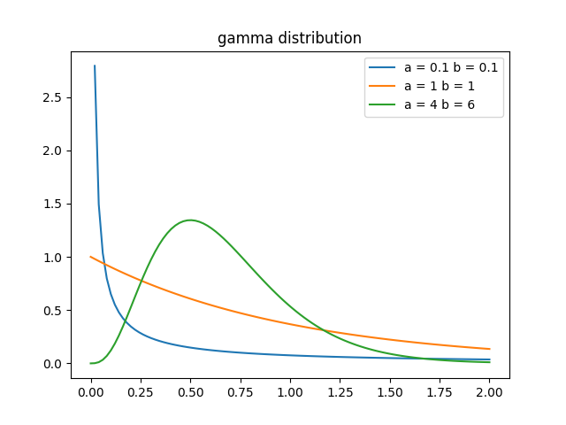

Source codes for Gamma distribution
 ---
 
I upload source codes and figures for Machine Learning.

Libraries Used
---
- Python
  1. [numpy](http://www.numpy.org/)
  2. [scikit-learn](http://scikit-learn.org/stable/)
  3. [matplotlib](https://matplotlib.org)
  
Usage for some programe
---
~~~
>> python gamma.py
~~~
__You can save some figures of each distribution.__

__You can change some parameter of each distribution.__

Result
---

 
Developers
---
Implementor
 - [Tatsurou Miyazaki]
