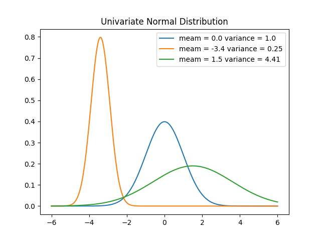
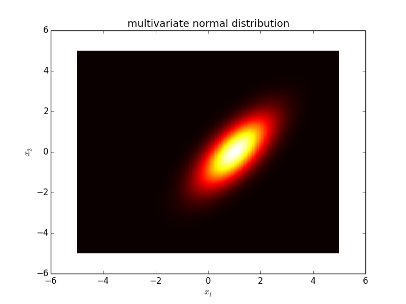

Source codes for Gaussian distribution
 ---
 
I upload source codes and figures for Machine Learning.
I have implemented the following some distributions.
1. __unicariate normal distribution__
2. __multivariate normal distribution__

Libraries Used
---
- Python
  1. [numpy](http://www.numpy.org/)
  2. [scikit-learn](http://scikit-learn.org/stable/)
  3. [matplotlib](https://matplotlib.org)
  
Usage for some programe
---
```vim
python unicariate_noraml.py
```
or

```vim
python multivariate_normal.py
```

__You can save some figures of each distribution.__

__You can change some parameter of each distribution.__

Result
---


 
Developers
---
Implementor
 - [Tatsurou Miyazaki]
