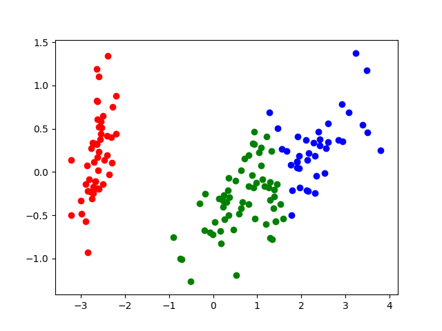

Source codes for Kmeans
 --- 

I upload source codes of Kmeans and figure that shows result of Kmeans.

I implemented source code of Kmeans without scikit-learn. (but I use dataset of Iris in scikit-learn.)

Libraries Used
---
- python
  1. [numpy](http://www.numpy.org/)
  2. [scikit-learn](http://scikit-learn.org/stable/)
  3. [matplotlib](https://matplotlib.org)

Usage for Kmeans
---
Saving the file "kmeans.py".

Next, you should import this file.

```python
from kmeans import Kmeans
```

and

```python
cls = Kmeans(clusterNum = 3)
X = cls.loadFeatures()
Y = cls.main(X)
cls.show(X, Y)
```

You can show the result of kmeans after typing this code in main function.

Result
---


Developers
---
Implementor
 - [Tatsuro Miyazaki]
