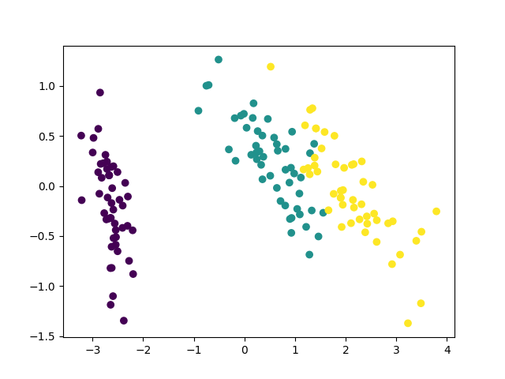

Source codes for PCA (principal component analysis)
 --- 
I upload source codes of PCA and figure that shows result of PCA.
I implemented source code of PCA without scikit-learn. (but I use the dataset of Iris that is in scikit-learn for verifing my code.) 

Libraries Used
---
- python
  1. [numpy](http://www.numpy.org/)
  2. [scikit-learn](http://scikit-learn.org/stable/)
  3. [matplotlib](https://matplotlib.org)

Usage for PCA
---
Saving the file "pca.py".

Next, you should import this file.
~~~
>> from pca import PCA
~~~

and
~~~
>> iris = load\_iris()
>> pca = PCA(n\_components = 2)
>> X = pca.main(iris.data)
>> plt.figure()
>> plt.scatter(x[:.0], x[:,1], color = iris.target)
>> plt.show()
~~~

You can show the result of pca after typing this code in main function.

Result
---

Developers
---
Implementor
 - [Tatsuro Miyazaki]
